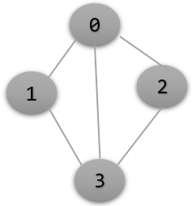
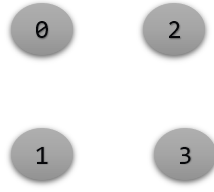

## Introduction 

* Breath First Search Algorithm is a fundamental search algorithm, which is used to explore vertices and edges of a graph. It is often used as a building block in other algorithms.

* BFS is particularly useful for one thing that is finding the shortest path on an unweighted graph. <br>

* BFS Algorithm runs in **O (V + E)**, where V is the number of vertices and E is the number of edges.<br>

* Breadth First Search Algorithm takes an unweighted graph as an input and a source vertex. Source Vertex is the vertex from where the bfs algorithm first starts and the unweighted graph can be either undirected or directed graph.<br>

* BFS can also work on connected and disconnected graph.<br>
 
 - - - -

<br>
**Fig-Example(a)**
<br>
> Let Us see the Fig-Example(a), we are given an unweighted graph which is non-cyclic and a source vertex 0. Our task is to bfs from the source vertex 0.<br>

> In breadth First Search Algorithm, first we will print the source vertex 0 in the output screen and then its neighbors that is 1 and 2. Now we will print the neighbors of 1 and 2. As you can see, 1 do not have any neighbors (zero), so we will not print anything in the output screen, but 2 have neighbors 3 and 4, so will print it.

>  Now the final output is 0 1 2 3 4, it can also be written as 0 2 1 4 3 or 0 1 2 4 3. <br>

> The idea of bfs is very similar to level order traversal, we just must print all vertices in a level order format. In the fig-example(a), the vertex 0 is at zero level, vertex 1 and 2 is at first level and vertex 3 and 4 is at second level.


## Idea and procedure
* Suppose we have an undirected non-cyclic graph(fig-a), and a source vertex is given as input. Our task to do bfs from the source vertex. 

* The procedure of Breadth first search algorithm is as follows: 

1. create a queue 
2.  Boolean dynamic array visited for each vertex, which will indicate that the vertex is visited or not, as applying bfs on a cyclic graph we may visit the    2. same vertex    twice if we do not use visited array. In the beginning the visited array is initialized as false.

3. Initially we will enqueue the source vertex 0 in the queue (Q) and we will mark the 0 vertex as visited which is True. Now a loop will be running until the queue is empty. In the loop, we will first dequeue 0 from the queue(Q), print it on the output screen and then iterate over all the neighbors of 0 that is 1 and 2. If any of the neighbor of 0 is visited, we will not enqueue it, but if it not visited, we will enqueue it. As 1 and 2 are not visited we will enqueue it into the queue(Q) and mark 1 and 2 as visited.

4. After first iteration, now we will dequeue the front of the queue that is 1, print it on the output screen and iterate over all the neighbors of 1. As in this case 1 do not have any neighbors, so we will not enqueue anything. In the third iteration, we will dequeue 2, print it on the output screen and iterate over all the neighbors of 2 that is 3 and 4. Both 3 and 4 are not visited so we will enqueue it into the queue (Q) and mark it as visited. 

5. In the fourth iteration, we will dequeue 3, print it on the screen and as in the graph 3 do not have neighbors so will not enqueue anything. In the Fifth iteration, we will dequeue 4 , print it on the screen and as 4 also do not have any neighbors we will enqueue anything. Now our program will stop as the queue is empty. The output screen is 0 1 2 3 4.

6. In each iteration, we are iterating through all the adjacency list of each vertex and if any vertex in the adjacency list is not visited , we will enqueue it into the queue(Q) and mark it as visited , as we do not want visit the same vertex twice.


## Implementation
```C++
void bfs(vector<int>edges[] , int v , int s){
  vector<bool> vis(v + 1 , false);
  queue<int> q;
  vis[s] = true;
  q.push(s);

  while(!q.empty()){
    int u = q.front();
    q.pop();
    cout << u << “ ”;	
    for(int x : edges[u])
	if(!vis[x]){
	  vis[x] = true;
	  q.push(x);
	}
    }
}
```		
	
## Time Complexity

The Time complexity of breath first search algorithm is O( V + E) , where v is the no. of vertices and E is the no. of edges. 
```C++
void bfs(vector<int>edges[] , int v , int s){
  vector<bool> vis(v + 1 , false);
  .
  ...
  while(!q.empty()){
   
    for(int x : edges[u]) // inner most loop
	if(!vis[x]){
	  vis[x] = true;
	  q.push(x);
	}
    }
}
```	


In the code above, in the inner most loop where we are traversing all the adjacency list of each node. So, If we find out the sum of length of all adjacency list, then we know the time complexity of breadth first search.
1. **As we know that the Sum of length of all adjacency list is twice the no. of edges in an undirected graph.**
2. **We also know the Sum of length of all adjacency lists is equal to the no. of edges in a directed graph.**

------
### Proof of Statement 1
<br>
Let us see the above undirected cyclic graph example to understand statement 1.


So first we will find out the sum of length of all adjacency list.
1. As there is 3 elements (1  , 2 , 3) in the adjacency list of 0 , so length is 3.
2. As there is 2 elements (0 , 3) in the adjacency list of 1 , so length is 2.
3. As there is 3 elements (0 , 1 , 2) in the adjacency list of 3 , so length is 3.
4. As there is 2 elements (0 , 3) in the adjacency list of 2 , so length is 2.<br>

The total sum is 10 and there are 5 edges in the undirected graph. So hence proved that sum of all adjacency list is equal to twice the no. of edges in the undirected graph.

------
<br>
**Fig-b** <br>

So know we know that the time complexity of bfs is O (E + V) .We know O(E) came from the inner most loop in the above code. But How does O(V) come and why are we adding it?
There is corner case (fig-b), where a graph is given, which is completely disconnected and has 0 edges. Our task to apply bfs on every graph, even if there are no edges. In the code below, we are applying bfs on each graph , so that’s the reason we are adding O(V) to the time complexity of bfs.
Hence the time complexity of bfs is O(V + E)

```C++
Main(){
vector<int> vis(v + 1 , false);
for(i = 0 to i = v - 1 ){
  if(!vis[i]){
     bfs( edges , i , vis);
  }
 }
}
		
```


