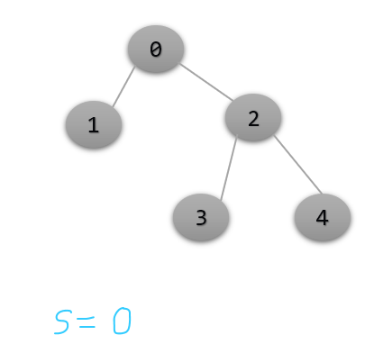

## Introduction 

* Breath First Search Algorithm is a fundamental search algorithm, which is used to explore vertices and edges of a graph. It is often used as a building block in other algorithms.

* BFS is particularly useful for one thing that is finding the shortest path on an unweighted graph.  

* BFS Algorithm runs in O (V + E), where V is the number of vertices and E is the number of edges. 

* Breadth First Search Algorithm takes an unweighted graph as an input and a source vertex. Source Vertex is the vertex from where the bfs algorithm first starts and the unweighted graph can be either undirected or directed graph. 

* BFS can also work on connected and disconnected graph. 

 
**Fig-example(a)**

Let Us see the Fig-Example(a), we are given an unweighted graph which is non-cyclic and a source vertex 0. Our task is to bfs from the source vertex 0.
In breadth First Search Algorithm, first we will print the source vertex 0 in the output screen and then its neighbors that is 1 and 2. Now we will print the neighbors of 1 and 2. As you can see, 1 do not have any neighbors (zero), so we will not print anything in the output screen, but 2 have neighbors 3 and 4, so will print it. Now the final output is 0 1 2 3 4, it can also be written as 0 2 1 4 3 or 0 1 2 4 3. The idea of bfs is very similar to level order traversal, we just must print all vertices in a level order format. In 
the fig-example(a), the vertex 0 is at zero level, vertex 1 and 2 is at first level and vertex 3 and 4 is at second level.

